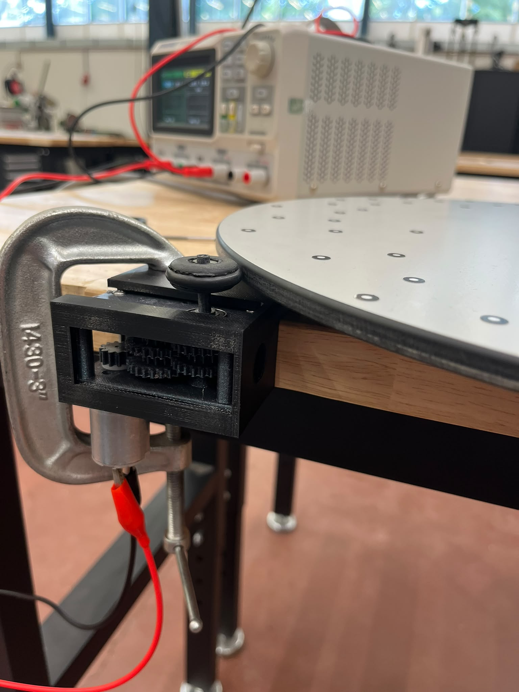
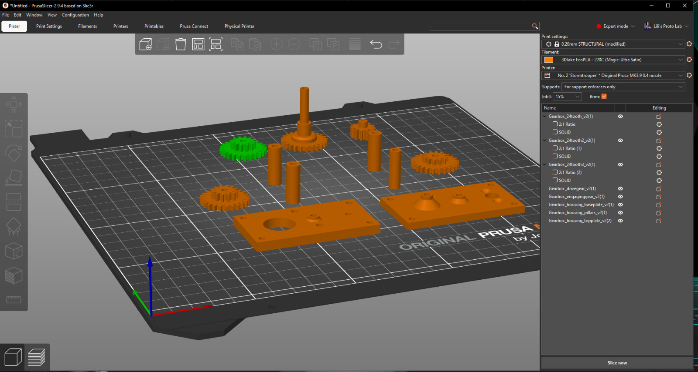
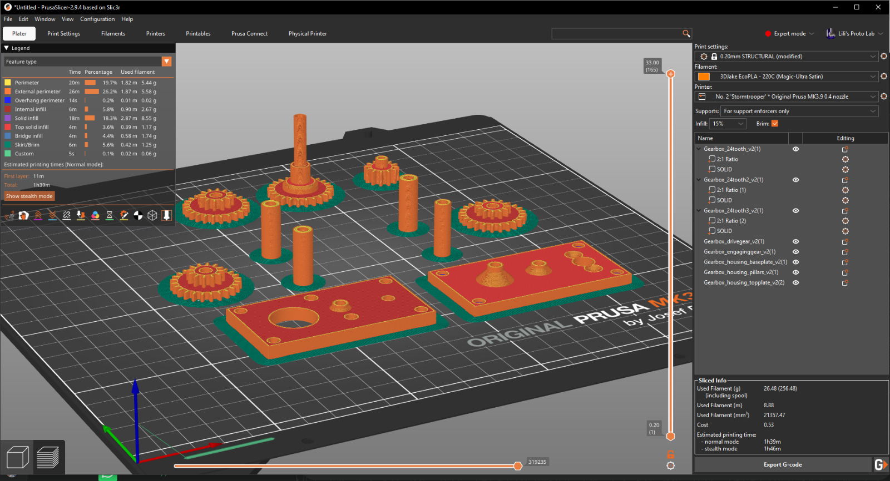
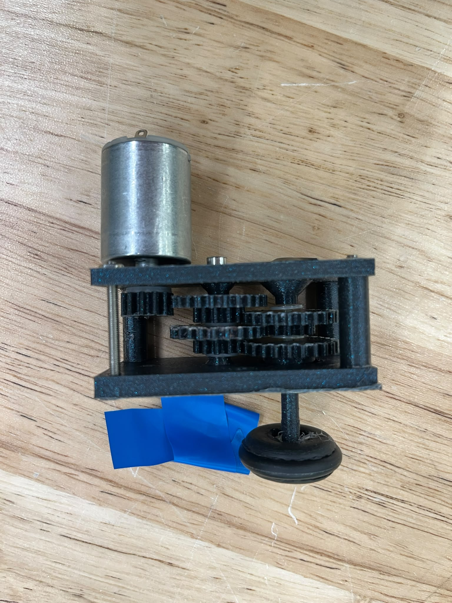
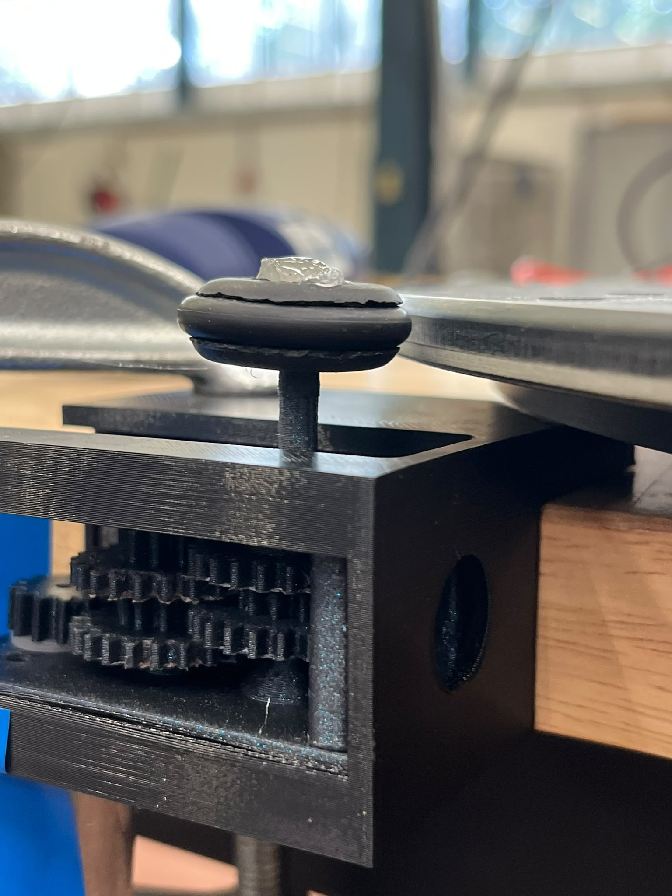

# 3D printing reproducibility challenge Group 1
 
In this repository, you will find all information you need to reproduce the 3D printed Gearbox.
The goal is to 3D-print and put together a gearbox, so we can spin a big plate at 8rmp and 50 rmp.(See picture below)

Step-by-step instructions - Group 1.
# Preparation:
1) Log into one of the three computers at Lili's Proto Lab in the 3D printing workspace. The password is on the monitor. 
2) Download all the .step files from this Github in Hardware-folder. 
3) Open the .step files in PrusaSlicer on the computer.

4) The objectes from the files will be stacked on top of eachother. Move them around, and make sure they are not touching eachother. Try to limit the space between them to limit printing time.
5) Make sure the base of each object is a flat surface. You can check this by moving your view to see the bottom of the objects. If not, flip the object by making use of the flip-icon on the left toolbar. 
    - Probably one of the big rectangle bases should be flipped and the gearbox_drivegear_v2.

6) If your happy with everything, press "Slice now" on the bottom right.

# Settings in the PrusaSlicer (top right):
Look for an available printer and look at its nozzle size
- Print settings: Set this to half the nozzle size of your printer. We used a 0.40 mm nozzle, so 0.20 mm Structural print settings.
- Filament: Pick a suitable filament. We used EcoPLA - 220C (Magic-Ultra Satin)
- Printer: Click on the printer you want to use. If there is finished work on the printer, make sure you remove it gently. 
- Supports: For support enforcers only
- Infill: 15%
- Brim: unchecked (It will make the gears more smooth around the edges. We found out the hard way, so ignore that one checked in the screenshots)

# Prepare the printer:
Go to your printer and follow the steps below.
1) Change the filament:
    - Press the 'Filament' icon on the printer
    - Press 'Change Filament'
    - When it reaches 100%: take out the filament of the printer. Put it away neatly by putting the filament through the holes in the circle. 
    - Add your filament of choice (PLA)
    - Select new material on the printer: PLA
    - Put the end of the filament in the hole of the printer nozzle like it was before. 
    - The printer will 'leak' some filament. Check if this has your desired colour. If not, 'purge more', otherwise press 'yes'.
2) Prepare the plate:
    -  Make sure you're using the Smooth Pei Sheet. If not, switch the plate with one in one of the drawers. 
    -  Clean the plate with a plastic scraper for excess plastic.
    -  Clean the plate with Isopropanol and a paper cloth. 

# Printing:
1) Ask a staff member to check your settings.
2) Send the G-code to the printer. (Bottom right symbol with a G)
3) Select print on the printer!
4) Sit back and relax, and enjoy your creation.

# Putting together the gearbox
Once your printer is done, leave the printed parts for some minutes on the printer so it can cool. Otherwise, deformations will occur.
In the meantime, gather the following parts:
- 4 Nuts
- 6 long bolts (long enough to go hold the top and bottom plate together)
- 5-7 very thin plastic washers
- 1 Bearing that fits the big hole in the top plate
- Rubber wheel with rubber band put in it (All in the same drawer)
- Motor (Ask someone from Lili's Protolab)

After you took your 3D printed parts off the sheet. Make sure there is no stuff inside the holes where the bolts need to go through. You can clean the inside by taking a drillmachine and a fitting drill bit for the holes (don't go too big).
Now, look at the picture below, how to ensemble the gearbox. (Tip: Add the motor and drivegear as last)
Check how smoothly the gearbox operates now and then.

Once, you've added the motor to it, it is time to complete the build with a rubber wheel. We hotglued the wheel onto the gearbox and used a small plastic nut as padding for the hole.
IMPORTANT!     Glue the rubber wheel at the correct height, after glueing, there is no way back. (Tip: try to mount your gearbox inside the table clamp first and compare heights with the big spinning plate.

After all this, we can try and spin the plate. Mount your gearbox in the table clamp. Let the rubber wheel be in contact with the big spinning plate. Connect the motor with a powersupply (Ask Staff) and try to make the wheel spin! 
After your confident enough that your gearbox works together with the rubber wheel, we can try to measure the rpm and try to regulate the rotation speed of the big plate.
